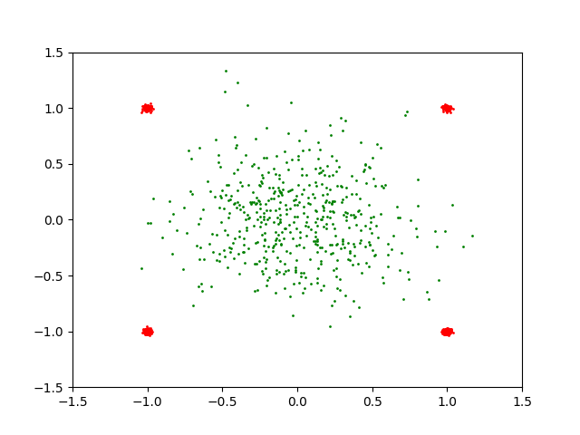
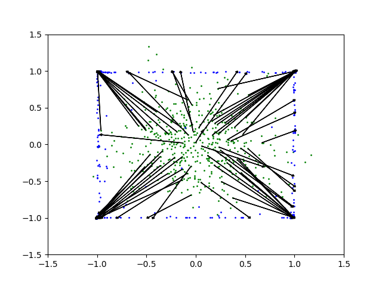

## large-scale-OT-mapping-TF

Tensorflow Implementation of the following paper:
```
Title:	
Large-Scale Optimal Transport and Mapping Estimation
Authors:	
Seguy, Vivien; Bhushan Damodaran, Bharath; Flamary, Rémi; Courty, Nicolas; Rolet, Antoine; Blondel, Mathieu
Publication:	
eprint arXiv:1711.02283
Publication Date:	
11/2017
Origin:	
ARXIV
Keywords:	
Statistics - Machine Learning
Comment:	
10 pages, 4 figures
Bibliographic Code:	
2017arXiv171102283S
```
[on arXiv](https://arxiv.org/abs/1711.02283)

[on OpenReview](https://openreview.net/forum?id=B1zlp1bRW)

### Some notes

- This repository does not contain an implementation of the entire experiment of the paper. Instead,
it confirms the thesis's core algorithm in a small toy example.

- Unlike the original paper, total batch-wise optimization is not implemented but I believe that it makes little difference.

- To run experiments, run `run.sh`.

- L2 regularization generally looks better than entropic regularization.

### Requirements
```
python3
tensorflow
matplotlib
seaborn
...
```

## Results (on L2 regularization)

##### Source and Target


Source points are green and target points are red.

##### Monge Map Estimation


Source points are green and transported points are blue.

##### KDE on transported distribution


#### Author
@mikigom (Junghoon Seo)

sjh@satreci.com
